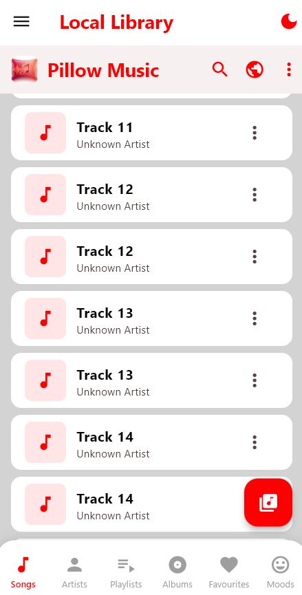
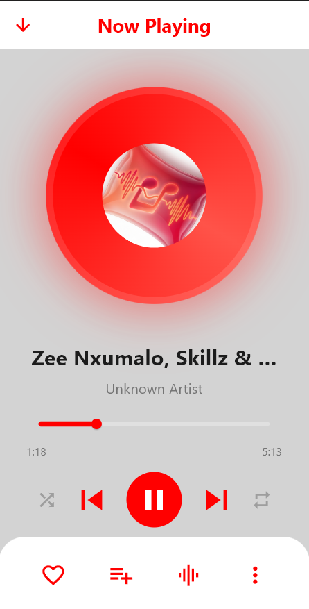
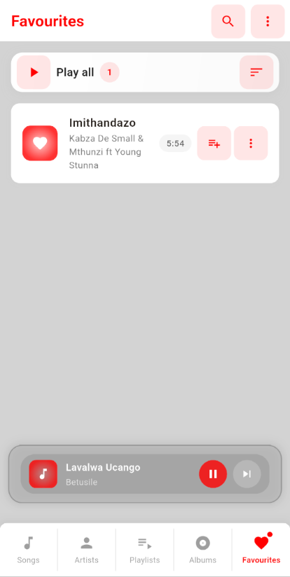
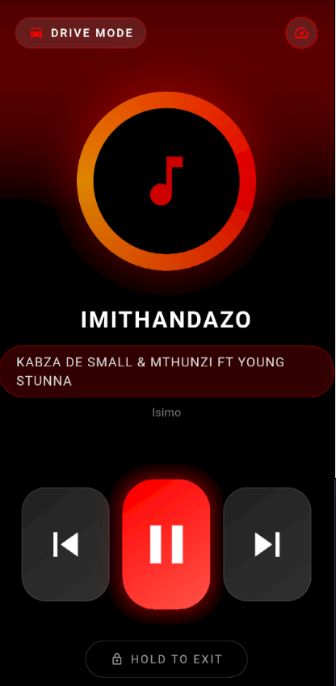

# Pillow

 music player application built with Flutter. Pillow offers a sleek and intuitive interface for managing and playing your music collection.

## Screenshots

| Songs Library | Now Playing | Favourites | Drive Mode |
|---------------------------|--------------------------|------------|------------|
|  |  |  |  |

## Features

### Beautiful UI

- **Custom Color Scheme:** Pure red (#FF0000) primary, with complementary orange (#FFA500), red-orange (#FF5349), and yellow-orange (#FFAE42) accents  
- **Professional Design:** Consistent card-based layout with gradients and shadows  
- **Smooth Animations:** Page transitions, mini player animations, and rotating disc in now playing  
- **Responsive Layout:** Works seamlessly across different screen sizes  

---

### Music Management

- Multiple Views: Songs, Artists, Playlists, Albums, and Favourites tabs  
- Sorting Options: Sort by time added, song name, artist, or manually  
- Playlist Management: Create, edit, and delete playlists  
- Favorites System: Mark songs as favorites with visual feedback  
- Song Counters: Display number of songs in each category  

---

### Player Controls

- Mini Player: Persistent mini player with play/pause and next controls  

#### Now Playing Page

- Rotating disc animation  
- Share button  
- Favorite toggle  
- Volume control  
- Playlist management  
- Shuffle, previous, play/pause, next controls  
- Equalizer (coming soon)  

---

### Settings & Preferences

- Scan Local Songs: Automatically detect music files on device  
- Audio Quality: Select between Low, Medium, and High quality  
- Storage Management: View storage usage and select storage location  
- Notifications: Toggle notification preferences  
- Auto Download: Automatically download music over Wi-Fi  
- Dark Mode: Toggle dark theme (coming soon)  

---

### Special Features

- **Driving Mode:** Simplified interface for safe driving 
- **Offline Mode:** Play downloaded music only  
- **Online Search:** Search and explore music videos on YouTube via SerpApi (New!)

---

## Technology Stack

- **Framework:** Flutter  
- **Language:** Dart  
- **State Management:** Provider  
- **APIs:** SerpApi (for YouTube Search)  
- **Animations:** Flutter's animation controllers and implicit animations  
- **Navigation:** Custom page routes with slide transitions  

---

## Getting Started

### Prerequisites

- Flutter SDK (>= 3.0.0)  
- Dart SDK (>= 3.0.0)  
- Android Studio / VS Code with Flutter extensions  

---

### Installation

1. Clone the repository

            bash
            git clone https://github.com/yourusername/pillow.git
            cd pillow

2. Install dependencies

            flutter pub get

3. Configure Environment
    - Create a `.env` file in the root directory
    - Add your SerpApi key: `SERP_API_KEY=your_api_key_here`

4. Run the app

            flutter run

---

## Project Structure

      lib/
      ├── main.dart                 # Main application entry point
      ├── models/
      │   └── song_model.dart       # Song data model and mock data
      ├── screens/
      │   ├── songs_page.dart       # Songs library view
      │   ├── artists_page.dart     # Artists library view
      │   ├── playlists_page.dart   # Playlists management
      │   ├── albums_page.dart      # Albums library view
      │   ├── favourites_page.dart  # Favorites collection
      │   ├── now_playing.dart      # Full-screen player
      │   ├── online_search_page.dart # Online YouTube search (SerpApi)
      │   ├── settings.dart         # App settings
      │   ├── mode.dart             # Playback modes
      │   └── drive_mode.dart       # Driving mode (placeholder)
      ├── services/                 # API & External Services
      │   ├── serp_service.dart     # SerpApi wrapper
      │   └── youtube_service.dart  # YouTube search implementation
      ├── widgets/                  # Custom widgets
      └── utils/                    # Utilities

---

## Building for Production

### Android

      flutter build apk --release

### iOS

      flutter build ios --release

## Contributing

- Contributions are welcome! Please feel free to submit a Pull Request.

1. Fork the project
2. Create your feature branch

            git checkout -b feature/AmazingFeature

3. Commit your changes

            git commit -m 'Add some AmazingFeature'

4. Push to the branch

            git push origin feature/AmazingFeature

5. Open a Pull Request

---

## License

- This project is licensed under the MIT License - see the LICENSE file for details.
